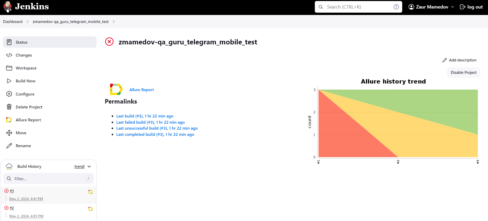
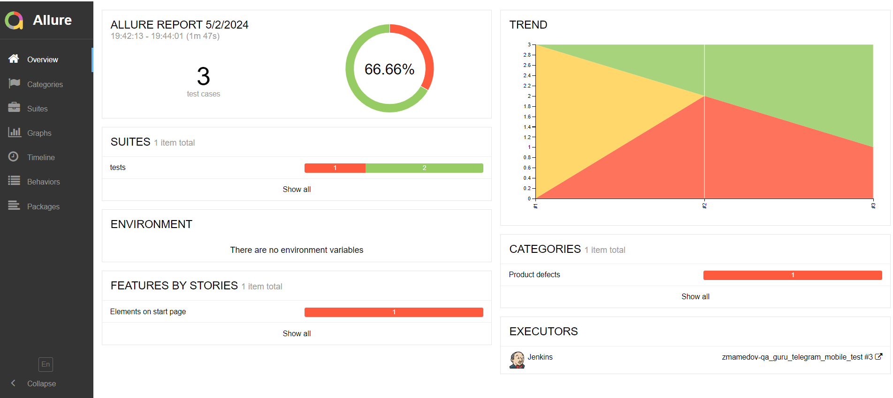
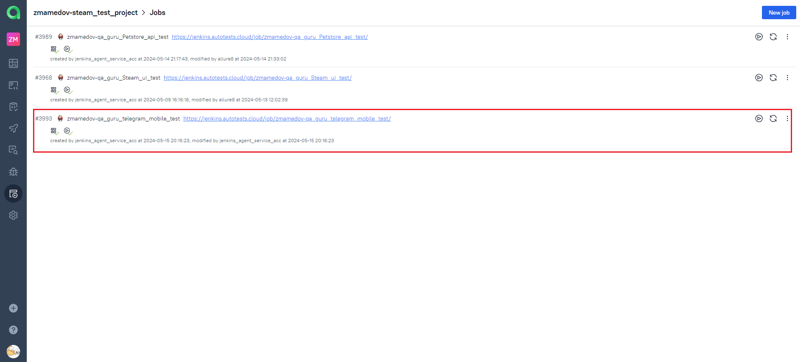
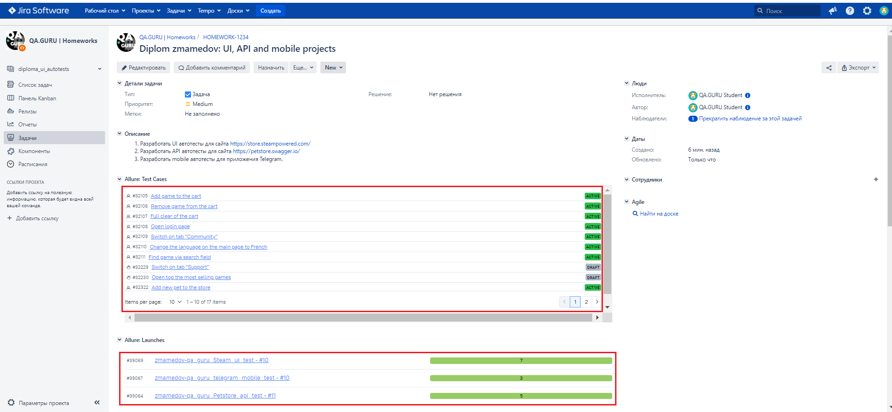
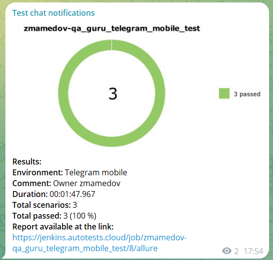

# Проект по тестированию мобильного приложения <a target="_blank" href="https://telegram.org/">Telegram</a>

---
### Список проверок, реализованных в автотестах
1. Нажатие на кнопку "Start messaging" на стартовой странице.
2. Переключение темы со светлой на темную.
3. Ввод номера телефона.

---

### Используемые инструменты
         

---

### Для запуска автотестов выполнить следующие команды

* Для запуска на эмуляторе андроида:       pytest -s -v --context=emulator .
* Для запуска на реальном девайсе:         pytest -s -v --context=local_device .
* Для удаленного запуска на BrowserStack:  pytest -s -v --context=browserstack .

> [!IMPORTANT]
> 
> Параметр --context необязателен, по умолчанию тесты запускаются на эмуляторе

### Запуск автотестов осуществляется с использованием Jenkins
> [Ссылка на сборку в Jenkins](https://jenkins.autotests.cloud/job/zmamedov-qa_guru_telegram_mobile_test/)

#### Для запуска автотестов в Jenkins
1. Открыть [задачу в Jenkins](https://jenkins.autotests.cloud/job/zmamedov-qa_guru_telegram_mobile_test/)

2. Нажать "**Build Now**".

---

### Allure отчет

---

### Интеграция с Allure TestOps

> [Job #3993 zmamedov-qa_guru_telegram_mobile_test](https://allure.autotests.cloud/project/4223/jobs)

---

### Интеграция с Jira
> [Задача в Jira](https://jira.autotests.cloud/browse/HOMEWORK-1234)
 

---

### Уведомления в Телеграм

---

### Прохождение автотеста

